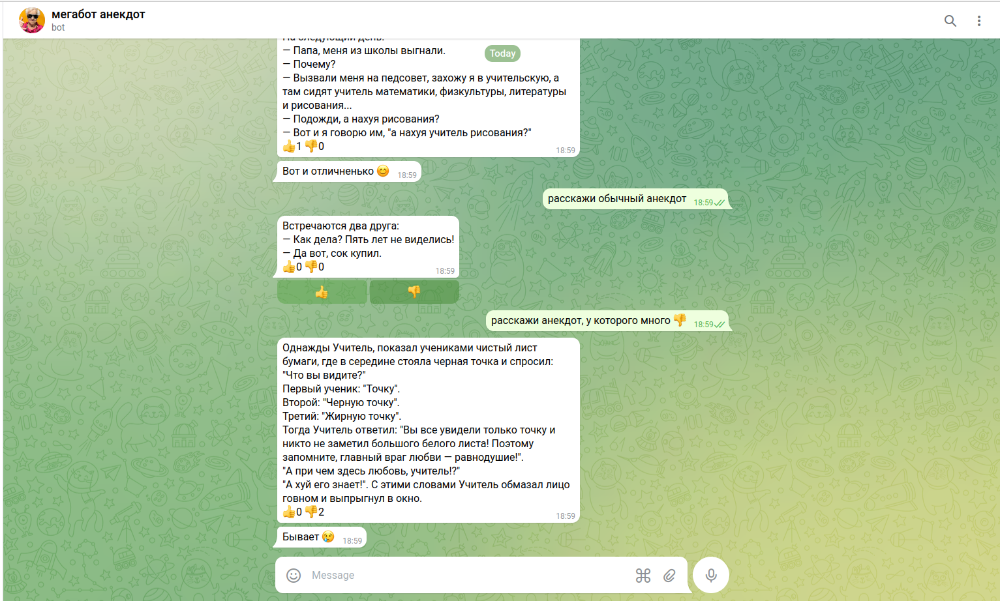

# megabot-anekdot
Бот парсит сайт с анекдотами и выдает случайный анекдот. Пользователи бота могут ставить лайки/дизлайки анекдотам.
Реализована база данных в которой будут добавляться скачанные анекдоты (чтобы не делать избыточных запросов к сайту) и количество лайков/дизлайков у конкретного анекдота. Бот работает круглосуточно на удалённом сервере.
Планируется добавить фильтр на наличие мата в анекдотах.

# Установка локально:
```bash
cd <folder_where_to_clone>
git clone git@gitlab.akhcheck.ru:andrei.sadchikov/graphplotter.git .
pip install requirements.txt
python3 app.py
```
Здесь рекомендуется поменять токен в файл config.py, так как если запустить на двух машинах двух ботов с одинаковым токеном, они оба упадут.

# Взаимодействие:
Открыть телеграм, написать @anekdot_megabot, далее интуитивно. Если пропадут кнопки, можно снова написать боту /start .



